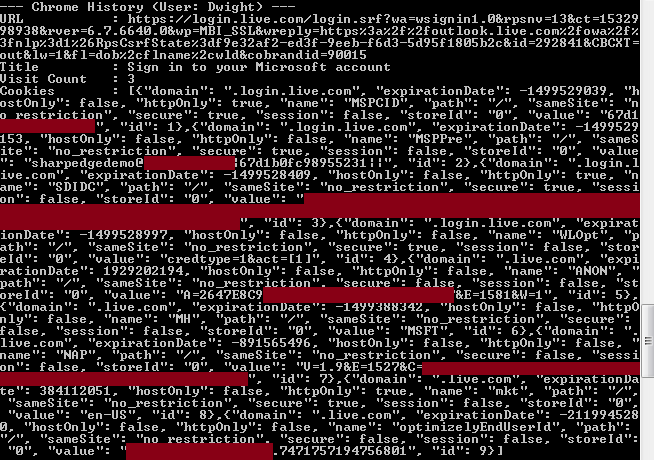
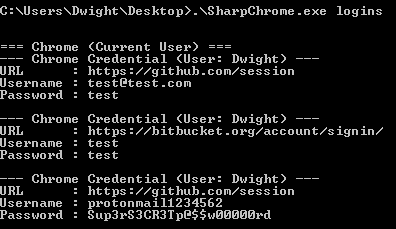

# SharpChromium

## Introduction

SharpChromium is a .NET 4.0+ CLR project to retrieve data from Google Chrome, Microsoft Edge, and Microsoft Edge Beta. Currently, it can extract:

- Cookies (in JSON format)
- History (with associated cookies for each history item)
- Saved Logins

Note: All cookies returned are in JSON format. If you have the extension [Cookie Editor](https://chrome.google.com/webstore/detail/cookie-editor/hlkenndednhfkekhgcdicdfddnkalmdm) installed, you can simply copy and paste into the "Import" seciton of this browser addon to ride the extracted session.

## Advantages

This rewrite has several advantages to previous implementations, which include:

- No Type compilation or reflection required
- Cookies are displayed in JSON format, for easy importing into [Cookie Editor](https://chrome.google.com/webstore/detail/cookie-editor/hlkenndednhfkekhgcdicdfddnkalmdm).
- No downloading SQLite assemblies from remote resources.
- Supports major Chromium browsers (but extendable to others)

## Usage

```
Usage:
    .\SharpChromium.exe arg0 [arg1 arg2 ...]

Arguments:
    all       - Retrieve all Chromium Cookies, History and Logins.
    full      - The same as 'all'
    logins    - Retrieve all saved credentials that have non-empty passwords.
    history   - Retrieve user's history with a count of each time the URL was
                visited, along with cookies matching those items.
    cookies [domain1.com domain2.com] - Retrieve the user's cookies in JSON format.
                                        If domains are passed, then return only
                                        cookies matching those domains. Otherwise,
                                        all cookies are saved into a temp file of
                                        the format ""%TEMP%\$browser-cookies.json""
```

## Examples

Retrieve cookies associated with Google Docs and Github
```
.\SharpChromium.exe cookies docs.google.com github.com
```


Retrieve history items and their associated cookies.
```
.\SharpChromium.exe history
```


Retrieve saved logins (Note: Only displays those with non-empty passwords):
```
.\SharpChromium.exe logins
```



## Notes on the SQLite Parser

The SQLite database parser is slightly bugged. This is due to the fact that the parser correctly detects data blobs as type System.Byte[], but it does not correctly detect columns of type System.Byte[]. As a result, the byte arrays get cast to the string literal "System.Byte[]", which is wrong. I haven't gotten to the root of this cause, but as a quick and dirty workaround I have encoded all blob values as Base64 strings. Thus if you wish to retrieve a value from a column whose regular data values would be a byte array, you'll need to Base64 decode them first.


## Special Thanks

A large thanks to @plainprogrammer for their C#-SQLite project which allowed for native parsing of the SQLite files without having to reflectively load a DLL. Without their work this project would be nowhere near as clean as it is. That project can be found here: https://github.com/plainprogrammer/csharp-sqlite

Thanks to @gentlekiwi whose work on Mimikatz guided the rewrite for the decryption schema in v80+

Thanks to @harmj0y who carved out the requisite PInvoke BCrypt code so I could remove additional dependencies from this project, making it light-weight again.